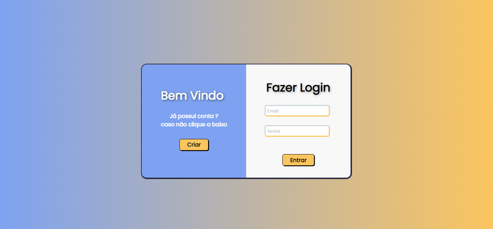
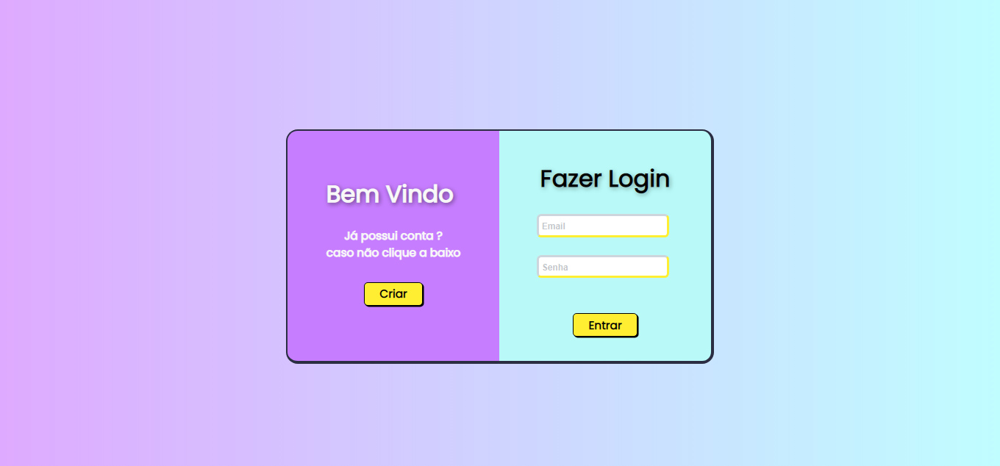
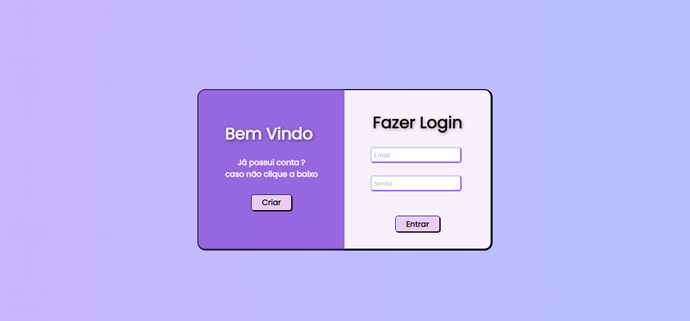
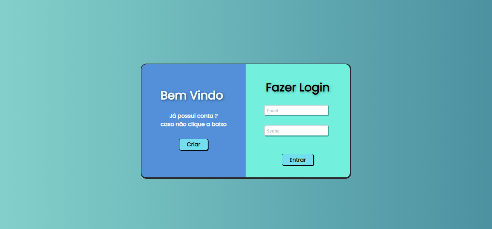

<h1 align="center">Tela de login HTML & CSS simples</h1>
<h3>CSS & HTML + <a href="https://animate.style">Animate.css<a/></h3>
### Recomendação:  
- Utilizar conta gotas para obter as cores de cada versão 
- Para cor de plano de fundo, utilizar conta gotas mais proximo das laterais 
- Ou utilize Cores que voçê preferir
  

<h3 align="center">v1.1</h3>

<h3 align="center">v1.2</h3>

<h3 align="center">v.1.3</h3>

<h3 align="center">v1.4</h3>

